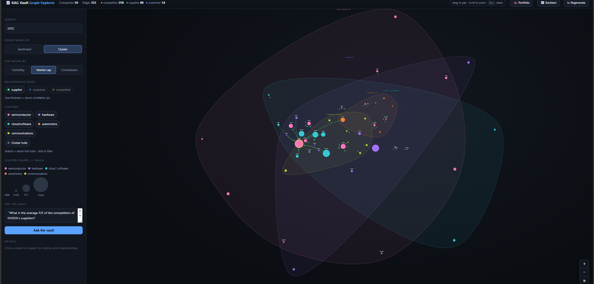
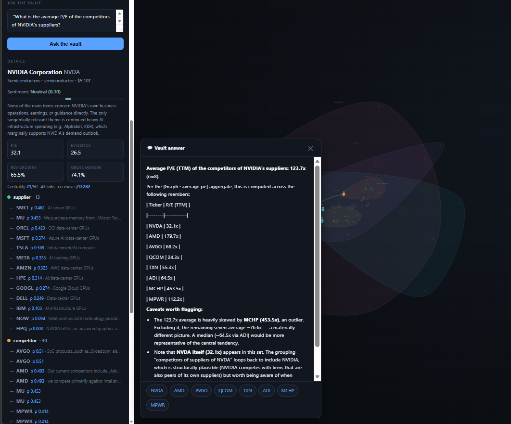
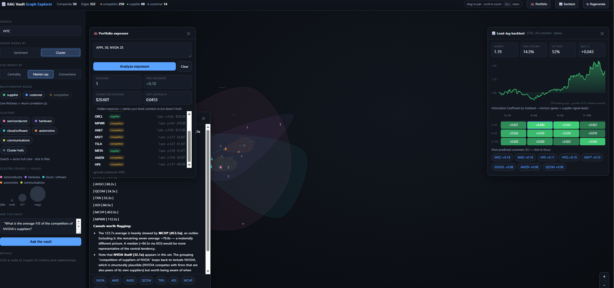

# S&P 500 Financial RAG Vault

Builds an **Obsidian vault** where every company gets a markdown note with
quant-level financials, an LLM sentiment score, and `[[wikilinks]]` to its real
supplier / customer / competitor companies — then puts a **RAG layer** on top so
you can ask cross-company questions in natural language.

Pilot scope: **50 tickers across 5 clusters** — semiconductors (19), hardware (9),
cloud/software (10), automotive (5), communications (7). Scaling to the full
S&P 500 is "add a sector cluster to `universe.py` and run the same layers" — and
it's cheap, because extraction is **incremental** (already-extracted tickers are
skipped unless you pass `--force`).

## Demo

📺 **[Watch the walkthrough on YouTube →](https://youtu.be/mjyl6hkgMoY)**

| | |
|:---:|:---:|
|  |  |
| Supply-chain graph — node size = **systemic centrality**, cluster hulls per sector, edges weighted by **return correlation** | **Ask the vault:** a multi-hop aggregate (*"average P/E of the competitors of NVIDIA's suppliers"*) answered as one grounded number — **computed in Python**, with the member breakdown |


*Portfolio exposure overlay (your holdings' connected supply-chain risk) + the lead-lag backtest — long/short equity curve and the Information-Coefficient heatmap.*

## Architecture

```
Ingestion ──► Processing ──► Vault (markdown + [[links]]) ──► RAG (LangChain + Chroma + Claude)
 yfinance      quant metrics    obsidian notes                 OpenAI embeddings, /query
 SEC EDGAR     Claude extract   + news logs                    incremental (daily) re-index
 Finnhub       Claude sentiment
 Alpaca        signals/backtest
```

| Layer | Module | Output |
|---|---|---|
| Quant | `quant.py` (`data_sources/market.py` — FMP → yfinance) | `data/quant/<T>.json` |
| Relationships | `relationships.py` (`data_sources/edgar.py`, `news.py`) | `data/relationships.db` |
| Sentiment | `sentiment.py` (`data_sources/news.py` — Google News + Yahoo RSS + Finnhub + Marketaux + NewsAPI + Alpha Vantage) | `data/sentiment/<T>.json` |
| Filings (8-K) | `filings.py` (`data_sources/edgar.py` — SEC 8-K material events) | `data/filings/<T>.json` |
| Event archive | `archive.py` (append-only 8-K + news log) | `data/archive/{filings,news}.csv` |
| Event backtest | `event_backtest.py` (event study by 8-K item type) | `data/signals/event_backtest.json`, `vault/_EventBacktest.md` |
| Signals | `signals.py` (Alpaca IEX → yfinance) | `data/signals/correlations.json`, `vault/_Signals.md` |
| Backtest | `backtest.py` (lead-lag) | `data/signals/backtest.json`, `vault/_Backtest.md` |
| Vault render | `vault_render.py` | `vault/<T>.md`, `<T>_news_log.md`, `_Dashboard.md` |
| RAG index | `rag.py` (LangChain + OpenAI embeddings + Chroma; note chunks + per-ticker news + 8-K events) | `data/chroma/` (incremental) |
| Graph export | `graph_export.py` | `data/graph/graph.json` (for future web viz) |
| Scheduler | `scheduler.py` | per-layer cadence refresh (Phase 7) |
| Query API | `api.py` | FastAPI `/query` |

## Setup

Secrets live in `.env` (already present): `ANTHROPIC_API_KEY`, `OPENAI_API_KEY`,
`FINNHUB_API_KEY`. News comes from **free RSS feeds first** — **Google News** and **Yahoo Finance**,
which need no key and have no daily quota, so they're the reliable backbone — plus
optional keyed APIs that broaden coverage: `FINNHUB_API_KEY`, `MARKETAUX_API_KEY`,
`NEWS_API_KEY` (NewsAPI.org), `ALPHA_API_KEY` (Alpha Vantage). Each keyed provider
is skipped gracefully if absent; the set/order is configurable via `NEWS_PROVIDERS`.
Providers are **interleaved by priority** (not globally recency-sorted) so every
source is represented, and the merged headlines are **indexed into the RAG** so you
can ask news-cycle questions. For **cleaner fundamentals**, set `FMP_API_KEY` (Financial
Modeling Prep): with `FUNDAMENTALS_SOURCE=auto` (default) the quant layer uses FMP
when the key is present and falls back to yfinance otherwise — no other change
needed. SEC EDGAR wants a contact email — set `SEC_CONTACT_EMAIL` in
`.env` (optional). Model defaults to `claude-opus-4-8`; override with
`ANTHROPIC_MODEL` / `ANTHROPIC_EFFORT`.

**Answer LLM is pluggable.** The RAG *answer* prose is written by Claude by
default; set `ANSWER_PROVIDER=openai` (with `OPENAI_ANSWER_MODEL`, default
`gpt-4o`) to use OpenAI instead. This only changes *who narrates* — graph/quant
answers are still computed in Python and semantic answers still summarize the same
retrieved chunks — so pick by cost/credits. (Relationship extraction and sentiment
always use Claude's structured outputs.)

```bash
.venv/Scripts/python.exe -m pip install -r requirements.txt
```

## Run

```bash
# Full pipeline over the pilot universe
python -m sp500_vault.pipeline all

# Cheap test run: 3 tickers through every layer
python -m sp500_vault.pipeline all --tickers NVDA,AMD,AAPL

# Individual layers (they refresh on independent schedules)
python -m sp500_vault.pipeline quant
python -m sp500_vault.pipeline quant --force   # re-fetch all fundamentals (e.g. after adding FMP_API_KEY)
python -m sp500_vault.pipeline relationships --sector cloud_software   # one cluster at a time
python -m sp500_vault.pipeline sentiment
python -m sp500_vault.pipeline filings        # SEC 8-K material events (earnings, exec changes, M&A)
python -m sp500_vault.pipeline signals        # price co-movement validation + edge weights
python -m sp500_vault.pipeline backtest       # supplier-momentum -> customer lead-lag
python -m sp500_vault.pipeline archive        # accumulate 8-Ks/news into the append-only event archive
python -m sp500_vault.pipeline eventbacktest  # event study: forward returns after 8-Ks, by item type
python -m sp500_vault.pipeline vault          # also writes _Dashboard.md
python -m sp500_vault.pipeline index          # incremental — only re-embeds changed chunks
python -m sp500_vault.pipeline index --force  # full rebuild (re-embed everything)
python -m sp500_vault.pipeline export         # data/graph/graph.json
python -m sp500_vault.pipeline dashboard      # just the dashboard MOC
python -m sp500_vault.pipeline stats          # coverage snapshot across all layers
python -m sp500_vault.pipeline eval           # RAG retrieval quality (recall@k, MRR, hit-rate)
python -m sp500_vault.pipeline eval --judge   # + LLM-graded answer faithfulness (Claude)

# Adding companies is cheap — extraction skips already-done tickers:
python -m sp500_vault.pipeline relationships              # incremental (skips cached)
python -m sp500_vault.pipeline relationships --force      # re-extract everything

# Ask the vault (query --sector filters by the note's GICS sector, e.g. Technology)
python -m sp500_vault.pipeline query "Which companies are most exposed to NVDA guidance cuts?"
python -m sp500_vault.pipeline query "Cheapest names by P/E" --sentiment Bullish

# Phase 7 — self-updating vault (wire `tick` into Task Scheduler / cron)
python -m sp500_vault.scheduler status        # what's due
python -m sp500_vault.scheduler tick          # run due layers, then re-render/index/export
python -m sp500_vault.scheduler run --interval 3600   # daemon

# Real-time 8-K poller — react to material events minutes after they hit the wire (free)
python -m sp500_vault.edgar_live status               # CIK mapping + what the feed matches now
python -m sp500_vault.edgar_live tick                 # poll once and react (cron-friendly)
python -m sp500_vault.edgar_live watch --interval 120 # daemon, polls every 2 min

# Serve the web UI (interactive graph + ask-the-vault) and API
uvicorn sp500_vault.api:app --reload
#   http://127.0.0.1:8000/            -> graph explorer (D3 force graph + RAG box)
#   POST http://127.0.0.1:8000/query  -> RAG endpoint
#   GET  http://127.0.0.1:8000/graph.json
```

### Web graph explorer

**Open it:** start the server (`uvicorn sp500_vault.api:app --reload`) and visit
**http://127.0.0.1:8000/** in a browser. Open it via that URL, **not** by
double-clicking `graph.html` — the page fetches `/graph.json` and posts to
`/query`, so it needs the running backend (a `file://` open has no server).

`sp500_vault/web/graph.html` is a dependency-free D3 single-page app (D3 loaded
from CDN — needs internet in the browser) served by FastAPI:

- Node **size** = **systemic centrality** (weighted PageRank over the
  correlation-weighted graph; or market cap / connections) · **color** =
  sentiment (or cluster) · **ring** = cluster. Toggle **Color by** / **Size by**.
- **Directed, arrowheaded edges** colored by relation (all three on by default;
  toggleable). **Edge thickness = daily-return correlation (ρ)** from the signals
  layer — thicker links co-move more.
- Click a node to highlight neighbors and see its quant metrics + relationships;
  hover for a tooltip; search, zoom (＋/−/**fit**), `Esc` to clear.
- **Vault chat** posts to `/query` and is **conversational** — it keeps the
  turn history so follow-ups resolve against context (*"what about its
  suppliers?"* after a question about NVIDIA → searched as *"Who are NVIDIA's
  suppliers?"*, shown as `↳ searched: …`). Answers render as markdown with
  clickable `[[TICKER]]` links, **inline source citations** (news / 8-K URLs you
  can click through to), and source chips. **↺ New chat** resets the thread.
- **📈 Backtest** opens a card with the lead-lag IC heatmap + long/short equity
  curve. **💼 Portfolio** takes your holdings (e.g. `AAPL 30, DELL 25, NFLX 20`)
  and highlights their connected supply-chain exposure on the graph — weighted
  sentiment, connected market-cap, and the hidden names ≥2 of your positions
  depend on (concentration risk).
- **↻ Regenerate** (top bar) re-exports `graph.json` from the current vault data
  server-side (`POST /regenerate` → `graph_export.run()`; no LLM calls) and swaps
  it in live — use it after editing the overrides CSV or re-running a CLI layer.

You can also regenerate from the CLI: `python -m sp500_vault.pipeline export`.

Open the `vault/` folder in Obsidian and turn on graph view to see the supply web.
Add `relationships_manual_overrides.csv` rows for high-confidence edges that
aren't disclosed in filings — they're tracked separately for auditability.

## Refresh cadence (per the plan)

- **Quant** — quarterly (on earnings)
- **Relationships** — annually (on 10-K filing)
- **Sentiment** — daily / weekly (most perishable)
- **Signals** — daily (price-based return correlations)

The signals layer is also a *validation*: it checks whether linked companies
actually co-move. On the pilot, linked pairs correlate at **0.33 vs 0.15** for
unlinked (**+0.17 lift**) — i.e. the supply/competitive graph tracks real
market behavior. See `vault/_Signals.md`.

The **backtest** layer goes further — does a supplier's move *lead* its
customer's? Using supplier price momentum as the signal, every (lookback,
horizon) cell has a **positive Information Coefficient**, and a market-neutral
long/short portfolio earns a **Sharpe ~1.2**; the most-predicted customers are
supply-chain-dependent assemblers (SMCI, AMD, HPE). A true *sentiment* lead-lag
needs history, which now accumulates in `data/sentiment/history.csv` for later.
See `vault/_Backtest.md`.

The **event-driven backtest** is a true event study over the **append-only
archive** (`archive.py`) — every 8-K and headline is accumulated over time
(written by the daily layers *and* the real-time poller, and back-fillable from a
year of EDGAR history). For each filing it measures the **market-adjusted forward
return** (`stock − SPY`) over 1/3/5 days and aggregates by 8-K item type with a
hit-rate and t-stat. On the seeded year (644 filings), **Reg-FD disclosures (item
7.01) show ~+1.6% 5-day abnormal return with t≈2.1**, while scheduled earnings
(2.02) show little drift — i.e. the *unscheduled, discretionary* disclosures carry
the tradable signal. N and significance grow as the archive accumulates. See
`vault/_EventBacktest.md`.

Each layer is its own subcommand precisely so they don't have to refresh together.

## Daily automation (Windows Task Scheduler)

A scheduled task **`SP500_RAG_Vault_Daily`** runs `scripts\daily_refresh.bat` every
day at 6:00 AM → `python -m sp500_vault.scheduler tick`, which refreshes the due
layers (sentiment/signals/backtest), re-renders the vault, and **incrementally
re-embeds only the changed chunks**. Output appends to `data\scheduler.log`.

```powershell
Get-ScheduledTaskInfo    -TaskName SP500_RAG_Vault_Daily   # status / next run
Start-ScheduledTask      -TaskName SP500_RAG_Vault_Daily   # run now
Unregister-ScheduledTask -TaskName SP500_RAG_Vault_Daily   # remove
```

### Real-time 8-K reaction (intraday, free)

The daily job covers the slow-moving layers; **8-K material events are
time-sensitive**, so `edgar_live.py` watches them in near-real-time. It polls SEC
EDGAR's **`getcurrent`** feed (continuously updated; no key, no quota) every ~2
minutes, matches entry CIKs against the universe, and on a new universe 8-K
refreshes that ticker's filings and **incrementally re-embeds its `Material
Events` chunk** — so the vault reacts **within minutes of the filing hitting the
wire**, before most financial press writes it up. The feed even carries the item
codes inline (`Item 5.02: …`), so the event *type* is known straight from the
poll. Run `scripts\edgar_live_watch.bat` as a Startup task (always-on daemon), or
point Task Scheduler at `sp500_vault.edgar_live tick` on a 2–5 min trigger. A
content-hash `seen` set means restarts never re-react to filings already ingested.
True sub-second push would need a paid websocket feed; this poller is ~free and
gets the reaction latency to minutes.

See **[`RAG_ROADMAP.md`](RAG_ROADMAP.md)** for the plan to take the RAG system to
institutional grade — data feeds, reranking, hybrid retrieval, and eval/observability.

## Development

```bash
.venv/Scripts/python.exe -m pytest tests/ -q   # unit tests for the pure logic
```

`tests/test_core.py` covers the deterministic functions (formatting, markdown
chunking, ticker resolution, NaN sanitizing, weighted PageRank, edge shaping,
eval metrics) — no network or caches, so it's a fast guard against regressions.

**RAG evaluation (Lean Phase 1):** `eval/golden_questions.json` is the analyst
ground-truth set; `pipeline eval` runs it through the retriever and reports
**recall@k / MRR / hit-rate**. It also runs a `graph_queries` section —
**deterministic regression guards** for the ranking / aggregate / multi-hop
router. Those aren't scored probabilistically: each asserts the *exact* selected
member set (relationship/scope-derived, so stable across data refreshes) and, for
aggregates, that the value recomputes against an **independent reducer**
(drift-proof vs live P/E / market cap). The run prints e.g. `graph-queries=7/7`,
so a refactor that breaks `parse_chain`, the scope buckets, or a reducer fails
loudly. It's the metric loop that de-risks every upgrade in
[`RAG_ROADMAP.md`](RAG_ROADMAP.md) — and it already earned its keep on the
**reranker**: the eval rejected a generic CPU cross-encoder (recall@8 0.67 → 0.62,
*worse*) and justified the **LLM reranker** (Claude listwise, 0.67 → ~0.8). The
reranker is pluggable via `RERANKER` (`llm` | `cross_encoder` | `none`); `rerank.py`.
`pipeline eval --judge` adds Claude-graded answer faithfulness.

**Performance:** quant and sentiment fetch in parallel (thread pools); relationship
extraction is incremental (skips tickers already LLM-extracted). The **RAG index is
also incremental** — it keeps a content-hash manifest and only re-embeds chunks
whose text changed, so the daily refresh re-embeds ~1 chunk per note (the sentiment
section) instead of the whole vault. Each layer refreshes on its own cadence via
`scheduler.py`, which re-renders + re-indexes whenever a data layer changes — so
running `scheduler tick` daily keeps the vector store current for near-zero cost.

**Retrieval is graph-aware:** beyond MMR vector search, when a question names a
ticker/company the retriever also pulls that name's supply-chain **neighbors'**
chunks into context (`rag._graph_expand`), so answers reason over connected
exposure — not just the named company's own note.

**Retrieval is news-aware:** each company's recent headlines (merged across the
free RSS + keyed providers, newest-first) are embedded as a per-ticker `News`
chunk, so questions like *"what's the latest news driving NVIDIA?"* retrieve actual
dated headlines — not just the one-line sentiment summary. The news chunk re-embeds
only when the headlines change, so the daily refresh keeps the RAG current for ~50
small embeddings (fractions of a cent). The raw articles also accumulate sentiment
history in `data/sentiment/history.csv` for the lead-lag work.

**Retrieval is filing-aware (8-K material events):** the `filings` layer pulls each
company's recent **8-K** filings from SEC EDGAR — one cached request per ticker —
and maps the **item codes to the material-event taxonomy** (2.02 earnings, 5.02
executive change, 1.01 material agreement, 2.01 acquisition, 2.06 impairment, …).
Those events are embedded as a per-ticker `Material Events` chunk, so the vault
answers catalyst questions like *"what material events has NVIDIA filed, and did any
involve executive changes?"* grounded in the actual filing dates and types — all
free (no document fetch needed; the submissions index carries the item codes).

**Ranking & aggregate questions route to the graph, not the vectors.** A question
like *"which company is the most systemically central?"* or *"which memory makers
are the most bullish?"* has **no single chunk** that states the answer — it's a
computation over every node's metric. `graph_qa` detects this class (a metric
keyword **+** a superlative cue) and answers it from the structured `graph.json`
(centrality, degree, sentiment, P/E, market cap, growth, margins), with an
optional sub-industry **scope** ("memory and storage" → MU/WDC/STX). It returns
the ranked nodes as Documents, so the same `query()` and eval path is unchanged
— the LLM still writes the prose, grounded in the leaderboard. This closed the
last eval failure class (those two questions went from recall **0.00 → 1.00**;
suite recall@8 **0.76 → 0.88**, MRR → **0.93**, hit-rate → **1.0**).

The same router also handles **arithmetic aggregates** — *"average P/E of NVIDIA's
suppliers"*, *"total market cap of the hyperscalers"*, *"how many competitors does
AMD have"*. It composes a **set selector** with a **reducer** (`average` /
`median` / `total` / `count`) over any node metric. The number is computed in
**Python** (LLMs are unreliable at averaging a list) and handed to the model as a
grounded summary alongside the member rows, so the answer is auditable down to
each company's value — and nulls (e.g. a negative-earnings name with no P/E) are
dropped from the math, not faked.

The set selector does **multi-hop set algebra** (`graph_qa.parse_chain`): it walks
the relationship graph outward from a named company, so *"competitors of NVIDIA's
suppliers"* resolves as competitors(suppliers(NVDA)) and *"suppliers of Apple's
competitors"* as suppliers(competitors(AAPL)). Hops apply nearest-the-company
first, so the surface form ("X's Y's Z", "Z of Y of X") doesn't matter. Compose
that with the reducer and you get *"average P/E of the competitors of NVIDIA's
suppliers"* answered as one grounded number — graph database semantics without a
graph database.

Finally, **threshold predicates are the WHERE clause** (`graph_qa.parse_predicates`):
*"suppliers with sentiment > 0.5"*, *"competitors with P/E under 20"*, *"names with
market cap over $1T"*, *"companies with gross margin above 40%"* (and compound
`… and …`). A predicate filters the selected set **before** it's listed, ranked, or
aggregated, so it composes with all of the above — *"average P/E of NVIDIA's
competitors with sentiment above 0.4"* selects the neighborhood, filters by
sentiment, then averages P/E. Each comparator binds to the metric on its left;
filter clauses are stripped before the rank/aggregate metric is detected so the
filter's metric can't hijack it. Put together — **set selection · traversal ·
filter · rank/aggregate** — this is a small, auditable query algebra over the graph,
routed to from plain English.

## Notes / known limits

- Relationship extraction has false positives by nature — every edge carries a
  `confidence` and `extraction_method`, and only edges resolving to a modeled
  ticker render as `[[wikilinks]]` (others show as *external / not modeled*).
- Fundamentals default to yfinance; set `FMP_API_KEY` to use Financial Modeling
  Prep (cleaner TTM ratios from filings) with automatic yfinance fallback. Field
  scales are normalized across sources (notably debt/equity) so a mixed run stays
  consistent; each quant note records its `data_source`. (Polygon is a further
  swap-in for prices/fundamentals.)
- Private suppliers (Foxconn, etc.) are intentionally surfaced as external stubs
  rather than silently dropped.
